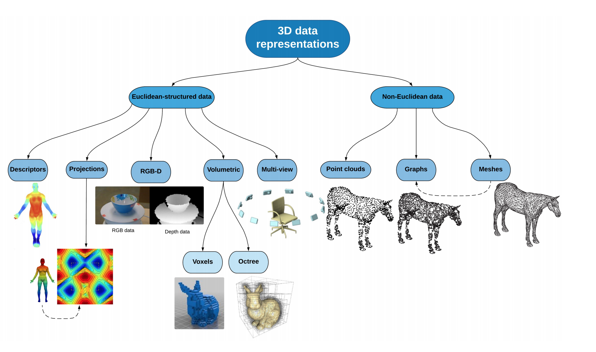
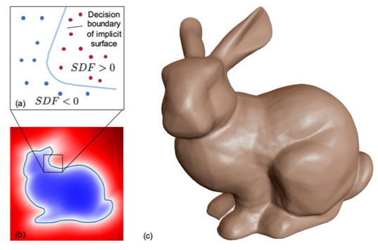
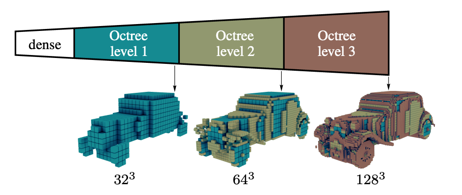
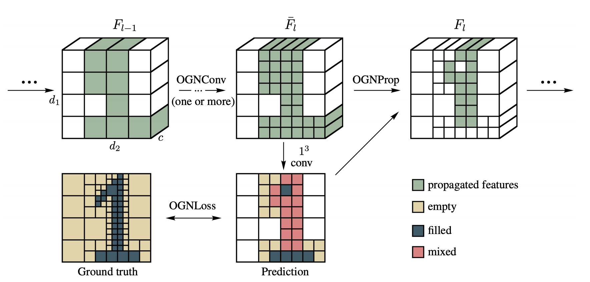

# DeepSDF: Learning Continuous Signed Distance Functions for Shape Representation

## Introduction

Representing 3D shapes is an open problem in 3D computer vision and computer graphics. A good 3D shape representation should be suitable for rendering, 3D reconstruction, object recognition, and many others. It should be memory efficient and computationally efficient while allowing us to get quantitative results. 

*There are many options to represent 3D data.*

In this post, I discuss DeepSDF, a method for learning a 3D shape representation method (signed distance functions) using a neural network. Using a fully continous representation, DeepSDF is able to represent structured 3D data much more efficiently than available discretized methods such as voxel-grid, without discretization errors. Unlike the compact surface representations, like meshes and point clouds, DeepSDF has the accuracy and structure of the grid representations.

### What is a Signed Distance Function (SDF)?

Let's start with what a signed distance function (SDF) is. It is a function that takes a point (a 3D point in our case) and gives its signed distance to the closest surface. The sign of this distance is `+` if the point is inside the surface, `-` otherwise. The surface is the region where the function takes the value `0`, also known as the zero level-set. Note that in shape representation, we assume the shape is a single closed (watertight) surface.

*Signed distance functions represent surfaces as a 0-level-set of a function*

Signed-distance functions can represent surfaces smoothly. If we consider two points, one with `+` and one with `-` signed distance, we can locate a point in the surface by computing their weighted average. Sampling multiple points near the surface, we can obtain a set of very precise locations for surface points. Rendering can be done with well-known algorithms, such as ray-casting and marching cubes. Last, but not least, some open-source software is available to reconstruct SDFs from depth image sequences obtained from commodity sensors.

### DeepSDF Motivations
SDFs are awesome! However, to be used in practical applications, they need to be stored as voxels (3D images). Voxels are very inefficient in terms of disk space, memory use and computation. Therefore, we have to discretize too much for efficiency, at the expense of losing accuracy.

DeepSDF people instead suggest learning the SDFs with a neural network. An SDF looks a lot like a nonlinear binary classifier, and neural networks are very good nonlinear classifiers!

### DeepSDF Contribution
DeepSDF authors propose a novel generative model to represent continuous signed distance functions. They show this model outperforms strong baselines in several shape representation challenges. In this section, I give high-level description of their main contributions. Further details will be given in the`Methodology` section.

At a high level, authors first define an embedding lookup, where each shape in a shape category has an embedding latent vector. They then train a single deep fully-connected neural network per shape category. The network takes the embedding vector and a 3D point as the input, and gives signed distance value as the output. New embedding vectors can be obtained for unknown shapes via interpolation or by optimizing for a new embedding vector.

*A basic sketch of the DeepSDF architecture. We have an Multi-Layer Perceptron (MLP) that is trained per shape category and a latent vector trained per shape. At inference, MLP takes a 3D point with the embedding and gives the SDF value.*

DeepSDF allows training a single neural network per an entire database of shapes, in our case a database of shapes in a single category. Embedding vectors can be pretty small, like 128 or 256 dimensional. Even if shapes were represented as very small voxel grids of size 32x32x32, a single voxel grid would take up the space of 128 embeddings!

The authors address three problems using their models. First, they try to compress a known category of shapes, measuring the accuracy of reconstruction using the shared neural network and small embeddings. Then, they address the same problem with unknown shapes to assess the learning capability of their model. Third, they attack the problem of shape completion, which is, as we will see, a very natural extension of the DeepSDF framework.

If you don't understand some details, don't worry, I will discuss further details on how they formulate the problem and train their models exactly. Before that, let's take a small break from DeepSDF and review shortly some related works that will serve our understanding.

## Related Works
### Shape Representation

Previously, we discussed there are many alternatives for representing 3D shapes. Some of these representations are related to the DeepSDF approach, while others serve as a baseline for comparison.

Authors think three lines of work in shape representation is relevant. Namely point-based, mesh-based, and voxel-based ones.

#### Point-Based

Point clouds are one of the most popular data formats used in 3D. Point clouds represent shapes as unordered sets of 3D points on the surface. Very ofen, they are the raw data format obtained from modern depth sensors (LiDARs, Kinect, etc.). Image in the left shows [an example point cloud of a torus object](http://sayef.tech/uploads/dynamic-graph-cnn/point-cloud-torus.png).

Recently, there is a hype around using them with neural networks, especially in 3D recognition. In this line of works, people can reach good performance by using a sparse set of points (usually 1k to 4k points). At this common scale, point clouds are computationally efficient and compact.

The downside of point clouds is the lack of topology information. We have a bunch of points without any information on how these points are related to each other! For rendering point clouds at a reasonable resolution, we may require a lot of points (100k or more per shape in my experience). Moreover, the authors claim point clouds are not suitable for generating closed (watertight) surfaces.

#### Mesh-based

  

Polygonal Meshes represent shapes as groups of points that form polygons on the surface. A triangular mesh is the default data format used for rendering in modern graphics hardware, and much more efficient than point clouds in this use case. Synthetic 3D models created by artists are often in mesh format by default. On the right, you see [an example mesh that models a dolphin](https://en.wikipedia.org/wiki/Polygon_mesh).

In the world of meshes, one related work very similar to DeepSDF approach is AltasNet. This work also uses embeddings and shared neural networks per category. The standard AtlasNet first parameterizes 2D squares, and then deform them into 3D rectangles. Combining many of those squares, a 3D quad-mesh is obtained. A sketch of the model architecture is seen below:

The aforementioned square-based AtlasNet approach cannot create closed surfaces. This is because combinint many local deformed squares do not give any global completeness guarantees. To address this problem, they also define a version that deforms a parametric sphere. This version drops some fine details, but it can create closed surfaces.

#### Voxel-based

Voxels are simply 3D images. Instead of having pixels at each point of a 2D grid, we have a voxel at each point of a 3D grid. Voxels can be used to represent different data formats (including SDFs) as a function of discretized 3D grid coordinates.

Voxels are super-easy to work with using neural networks! Just replace all `Conv2D` and `BatchNorm2D` layers with `Conv3D` and `BatchNorm3D` layers (and all others end with 2D with 3D) and you have the architecture! The problem is their inefficiency. In 3D shapes, surfaces are often quadratic while volumes are often cubic (compare volume vs. area formula of cube and sphere). As we increase the voxel resolution, memory use increases faster than the number of voxels on the surface. Since surfaces are what we are most interested in, voxels waste our resources.

One important related work in voxel-based shape representation is the Octree-generating network(OGN). OGN uses a hierarchical data representation called Octrees to generate shapes. OGN predicts both the structure and content of an octree with a convolutional neural network. Octrees can assign more voxels to more complex regions (e.g. face of a human), and less voxels to simple regions (e.g. backgroud). This adaptive resolution allow OGN to process high-resolution voxel grids efficiently.

*OGN makes prediction at multiple resolutions recursively.*

*OGN learns the octree structure, using grount-truth structure at multiple resolutions.*

### Generative Models
When it comes to popularity, generative models such as Generative adversatial networks ( GANs ) and variational auto-encoders (VAEs) are very big. Here, the authors point out their architecture is a special kind of generative model, called Auto-Decoder. Authors considered GANs and Auto-Encoders in addition to Auto-Decoder approach they chose to ground their decision.

#### Generative Adversarial Networks
GANs learn to generate data from latent embeddings by training discrimators adversarially against generators. They are very successful at generating high-dimensional continuous data, especially at generating images. Although GANs can also be applied to 3D domain, their adversarial training is known to be very difficult and unstable.  

#### Auto-Encoders

Auto-encoders learn to predict latent embeddings from the original input data using an encoder neural network. With the predicted latent code, the decoder network learns to reconstuct the original input. Auto-Encoders, especially the VAEs, used very commonly in 3D deep learning. However, in many 3D representation learning applications, only the decoder part is used. A natural question is: Why training a large encoder network is necessary if we won't use it?

#### Auto-Decoders

An Auto-Decoder is an auto-encoder without an encoder. It learns latent codes and a decoder for representing the data. Authors claim this architecture is easier to train compared to GANs and VAEs, and do not contain the unnecessary encoder module seen in Auto-Encoders.

The latent code learning can be understood as an `embedding_lookup` function that exits in many common deep learning software. We have an embedding vector for each data point, each element of whom is initialized and learned as a model parameter.

### Shape Completion
For shape completion, the authors compare their results with an architecture called 3D-EPN. This architecture predicts a coarse, low-resolution voxel grid from an incomplete one. Then, they increase this resolution by retrieving and using reference shapes. Another significance of this approach is that it uses SDFs in the voxel form.

*3D-EPN architecture that completes the incomplete voxel grids.*

## Methodology
In this section, I discuss the authors' mathematical formulation of SDFs as neural networks. As the authors do in the paper, I first start with the naive idea of training a neural network per SDF, and then study the re-formulation as a generative model. I also explain the data generation process, model and training details they use.

### SDFs as Neural Networks
We want a neural network model (or simply a parametric function approximator) that can produce signed distance values for a given point. Here, let's forget about shape databases and consider we have a single shape `X`. Our dataset is sampled from this shape, as ground-truth `(point, SDF(point))` pairs. We can now basically overfit a neural network to this shape. The resulting neural network becomes our DeepSDF representation.

DeepSDF technically learns a Truncated Signed Distance Function (TSDF). TSDF allows marking regions too far away from the surface as empty, making the SDF concentrate around the points in the surface, which are the ones that are important for rendering.

Now, let's go over the mathematical formulation of the ideas.We have a single shape that can be seen as a dataset of point-sdf pairs:

We want to approximate this dataset using a parametric function:

We can do so by optimizing the following loss function:

Above, the parameter 𝜹 controls the truncation distance, and `clamp(x, 𝜹) = min(𝜹, max(-𝜹, x))`. We can optimize parameters 𝜃 using gradient descent.

Clearly, this approach is not feasible. Yes, using voxels were inefficient, but so does having a several-million parameter neural network trained for each shape! This brings us to the auto-decoder based formulation.

### SDFs as Auto-Decoders
As noted before, DeepSDF can be seen as an auto-decoder. To be more specific, DeepSDF can be seen as a conditional auto-decoder. In this formulation, embedding vectors are latent codes, 3D points are conditions, and the neural network is the decoder. While a similar formulation is possible with other generative models, like GANs, authors chose to use an Auto-Decoder.  

Here, we rather have an array of `X`s, while every `X` still is a shape with `(point, SDF(point))` pairs. We have a single neural network and a set of latent vector `z`s, one vector per shape. Using this training data, we optimize both latent vectors and neural network parameters using backpropagation and gradient descent.

The tricky situation here is to use this model at inference. If you have previous experience in embeddings used in natural language processing (NLP), you would note that the situation here is pretty different. In NLP, each embedding vector represents a discrete element (often a character or a word). Both training and test data in a particular language is a sequence of these discrete elements, and a finite vocabulary can be assumed. In the DeepSDF case, infinite possible instances of a category, we can have infinitely many different objects. We, therefore, cannot assume there is a finite vocabulary of possible objects.

What instead can be done is to optimize a new latent vector of an upcoming shape. We freeze the network parameters, and simply using the fact that neural networks are differentiable with respect to their inputs, we optimize latent vectors using gradient-descent.

There are two very important points to make about the inference formulation. First, ground-truth point-sdf pairs are available in inference time as well! However, these ground-truth points are available only for a sample of points, and we want to obtain the continuous function for the whole shape. This detail is especially important for shape-completion, as we will see a little bit later. Second, inference requires an entire training process with multiple backward passes of the network. This makes the model very slow at inference, probably the biggest downside of the DeepSDF approach.

### Dataset Preparation
Of course, having a model is not enough to do deep learning, we also need data! Similar to most other works in 3D deep learning, they use a Computer-Aided Design (CAD) model dataset to obtain clean 3D shapes. In particular, they use the ShapeNet dataset, one of the most popular CAD model datasets (together with ModelNet). They normalize shapes into the unit sphere and ensure all shapes have a canonical pose (there are no upside-down chairs!). This coordinate system should be kept in mind, several values including the truncation distance (0.1) and virtually all the performance metrics from now on will live in the unit sphere coordinate system!

SDFs can be obtained from meshes, and as a synthetic dataset, ShapeNet consists of meshes. However, instead of using meshes, they sampled a lot of points from different viewpoints and sampled SDFs around them! It is ironic that they technically used a point-based representation for data preparation, but we should note that the task is sampling data, not rendering. Since authors want watertight (closed) surfaces being produced, they also employed a heuristic to eliminate non-watertight shapes. They do so by counting triangles whose different sides are observed from opposite views and eliminate the shapes where this count is large. This elimination is the major advantage of using a multi-view approach.

### Model and Training Details
In most of their experiments, authors used an 8-layer Fully Connected Network with a residual connection from input to layer 4. They use standard ReLU activations, but not-so-standard weight normalization instead of more popular batch normalization. The advantage of weight normalization over batch normalization is that it doesn't correlate shapes with each other. Adam optimizer with standard parameters is used. The truncation parameter is set to 0.1, and latent vectors are initialized from a normal distribution with small variance (reportedly 0.001). Tanh activation is used to ensure outputs are normalized. Training took 8 hours on 8 GPUs.

The authors made various ablation studies to justify their decisions. They showed, for example, that the residual connection is crucial for the optimization process, by conveying overfitting experiments at different model sizes. 

A very important ablation study that attracted my attention is the truncation parameter. One can see that larger truncation parameter values give worse results, as fewer resources are concentrated around the surfaces. In the end, shape representation is about representing surfaces. Clearly, though, we need to have a non-zero truncation distance for smoothness enabled by SDF representation. Hence, selected 0.1 is a good choice.

## Experiments
Let's now see some experimental results! Authors attacked three main tasks in this paper: 
1) Representing known shapes
2) representing unknown shapes
3) Shape completion. 
These tasks are quantitatively measurable. The quantitative results are compared against the baseline models I introduced in the related work section. 

Apart from how DeepSDF scores, I also opt to discuss two other important experiments in this post. The first one is that the quantitative results that show latent codes can be interpolated to obtain new shapes, something you see in all embedding papers. The second one is how noise effect the model performance, which I think is more interesting!

### Representing Known Shapes
Technically, we don't have to use neural networks for machine learning. They are simply nonlinear function approximator. Anywhere we need to approximate a function, we can use them! Representing known shapes is a non-learning task, where we address compression of a known shape database. 3D data are complex, so this overfitting task is still very difficult.

Here, what authors did is to directly follow the auto-decoder based training formulation. They optimize one latent vector per shape and a network for shape category. They then reconstruct surfaces using their trained models and embeddings, reporting better scores in Chamfer and Earth Mover's Distance metrics compared to baseline models.

### Representing Unknown Shapes
And now, we do actual learning! We have the same training method in the previous section, but this time we don't know the shape embeddings. Therefore, we just optimize the shape embeddings at inference. We train an Adam optimizer similar to training, but by freezing network parameters and only optimizing the latent vectors. The inference is very slow, but again DeepSDF outperforms the baseline models.

One very weird detail we have here is to assume we assume we have some ground-truth samples of SDF values for the shape! They basically show latent code can represent a continuous SDF from discrete samples, and a new latent code can be obtained from these discrete samples. Is this really learning or do we still overfit? It depends on your viewpoint.

### Shape Completion
A very natural extension of DeepSDF method is shape completion. More specifically, we now have a single depth camera image and try to obtain the whole shape from it. The details of surface elements not visible are missing.

I think this is the most interesting problem they attempt to solve. This is because we now don't have ground-truth SDF values to represent all faces of a surface, we have some hidden faces! Therefore, the model has to learn those faces.

The approach the authors used for shape completion naturally follows the inference formulation. We now also have some point- sdf samples and we optimize a latent vector for them. We then forward pass our deep neural network for points evenly sampled around the unit sphere coordinate system. Thus, we have the complete shape!

In quantitative metrics, DeepSDF outperforms the 3D-EPN baseline. This can also be seen qualitatively in the selected sample shapes the authors have shown.

### Quantitative Results on Embeddings
As in all embedding papers, authors show their embeddings can be interpolated linearly. An automobile is the average of a pickup and an SUV, and averaging wooden chair and a single-person sofa create a chair whose sides a closed like a sofa.

### Effect of Noise
Although authors chose the discuss the effect of noise in the supplementary section, I think this is something very important in terms of generalization capabilities of the model.

For assessing the effect of noise, authors picked the shape completion task and they injected Gaussian noise to depth maps. With an increasing standard deviation, the depth maps divergence from the correct shape is faster than the divergence of DeepSDF-generated shapes. That is, the DeepSDF can still produce high-quality shapes even if the noise corrupted the depth maps significantly. This is a very interesting result!

The authors claim this shows the "regularization effect" of DeepSDF model, something that suggests DeepSDF has good generalization properties. If that is true, then great! However, I have to admit the results look too good to be true. Further measurements should be done before claiming model really generalizes well or not. One experiment that comes to my mind is measuring the distance of generated shapes to the closest example in training data. The model could be just copying and pasting!

My criticism aside, the robustness of the model to noise is still something very desirable. It is very beneficial that the authors conveyed these experiments in my opinion.

## Conclusion

### Author's Conclusions
DeepSDF outperforms baseline models in shape compression and completion. It can represent closed surfaces, fine details, and complex topologies. However, they stress that the inference procedure is very slow since an iterative neural network optimization must be done. They point out a better optimization procedure, like Gauss-Newton, can be used to replace the current, inefficient process.

DeepSDF has significant memory advantage over previous methods, while also avoiding the discretization error. This can also be useful in representing real-world(wild) 3D scenes with multiple shapes in it in future applications. However, only shapes in canonical poses are used in this paper. Authors state that SE(3) transformation increases the complexity of the inference process by introducing an additional optimization challenge. They also note that dynamics and textures in wild scenes will increase the complexity of the latent space, posing a major challenge for future explorations.

### My Additions
In addition to conclusions authors reached, I have some additions.

I think, DeepSDF can be used in many interesting applications in 3D deep learning such as single-view 3D reconstruction, joined natural language processing and 3D, and many more. As the challenges authors pointed out in their conclusions being solved, these applications become more and more feasible. 

In my opinion, one downside of DeepSDF is that it is unclear how to use it in practical applications without discretization. How should I input a DeepSDF to another neural network without converting it to a set of points or a voxel grid? Considering authors stress a lot that their approach avoid discretization errors, this is a very important open problem for the future.
